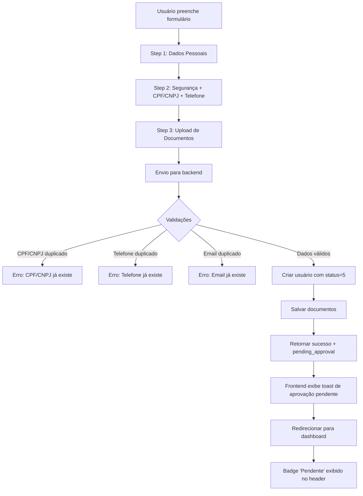
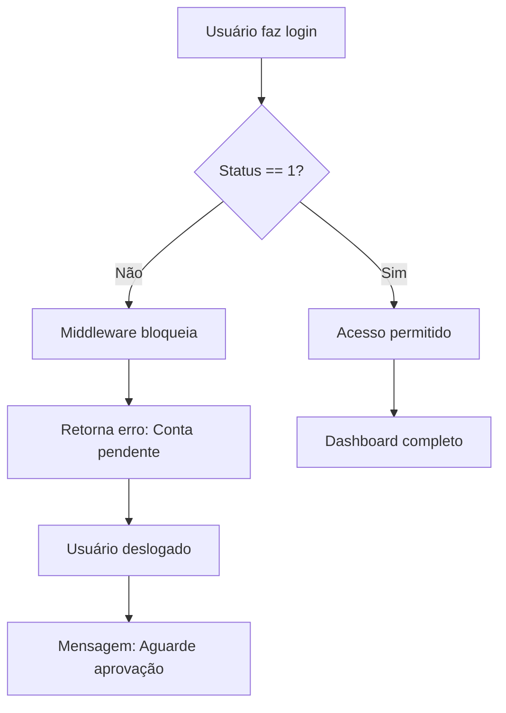
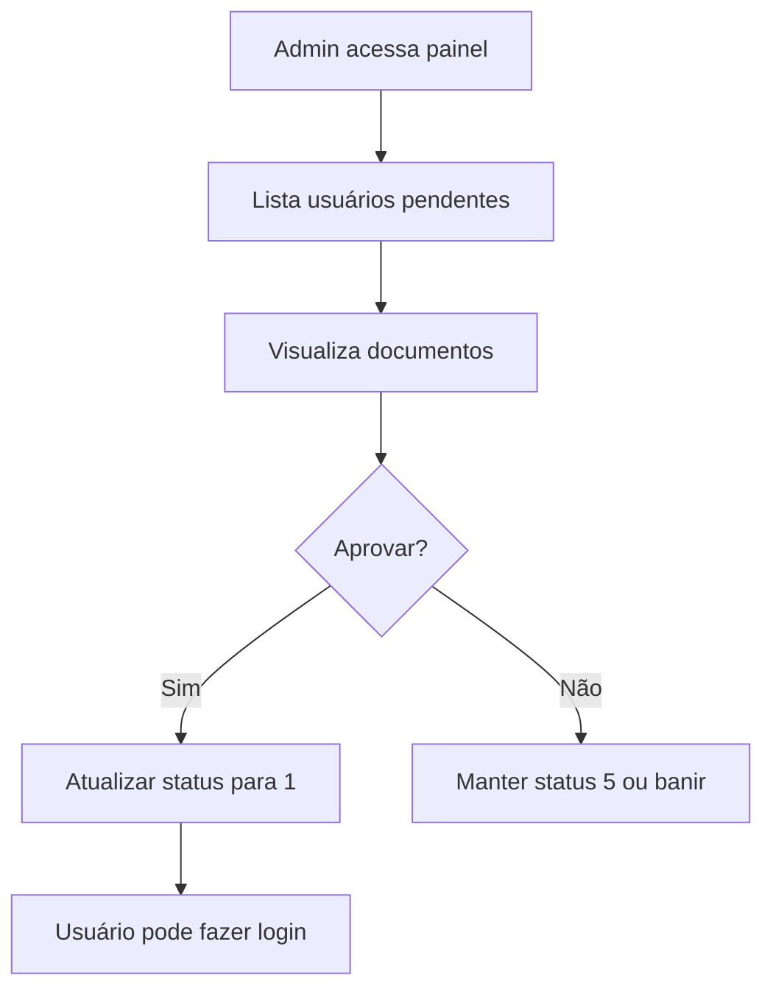

# 🔐 Fluxo de Aprovação de Conta

## 📋 Visão Geral

Sistema de aprovação de contas implementado para garantir segurança e controle de acesso. Novos usuários são criados com status **pendente (status = 5)** e precisam ser aprovados pelo administrador antes de acessar funcionalidades críticas da aplicação.

---

## 🎯 Funcionalidades Implementadas

### ✅ Backend (Laravel)

#### 1. **Validações no Registro** (`AuthController.php`)

- ✅ **CPF/CNPJ único**: Não permite cadastros duplicados
- ✅ **Telefone único**: Um telefone por conta
- ✅ **Email único**: Um email por conta
- ✅ **Upload de documentos**: Frente, verso e selfie (opcional)
  - Formatos aceitos: JPEG, JPG, PNG, PDF
  - Tamanho máximo: 5MB por arquivo
  - Armazenamento: `/public/uploads/documentos/`

#### 2. **Status de Conta**

| Status | Descrição             | Acesso       |
| ------ | --------------------- | ------------ |
| **5**  | Pendente de Aprovação | ❌ Restrito  |
| **1**  | Conta Aprovada        | ✅ Total     |
| **0**  | Conta Inativa         | ❌ Bloqueado |

#### 3. **Middleware de Verificação**

- `CheckTokenAndSecret`: Bloqueia API se `status != 1`
- `AuthMiddleware`: Redireciona para login se `status != 1`

#### 4. **Resposta do Registro**

```json
{
  "success": true,
  "message": "Cadastro realizado com sucesso! Sua conta está pendente de aprovação pelo administrador.",
  "data": {
    "user": {
      "id": "username",
      "username": "username",
      "email": "email@example.com",
      "name": "Nome Completo",
      "status": 5,
      "status_text": "Pendente de Aprovação"
    },
    "token": "...",
    "api_token": "...",
    "api_secret": "...",
    "pending_approval": true
  }
}
```

---

### ✅ Frontend (Next.js)

#### 1. **Formulário de Cadastro** (`cadastro/page.tsx`)

**Step 1 - Dados Pessoais:**

- Nome completo
- Nome de usuário
- Email

**Step 2 - Segurança:**

- Senha forte (min 8 caracteres, maiúscula, minúscula, número, caractere especial)
- Confirmação de senha
- Telefone com máscara: `(11) 99999-9999`
- CPF/CNPJ com máscara dinâmica:
  - CPF: `000.000.000-00`
  - CNPJ: `00.000.000/0000-00`
- Validação em tempo real

**Step 3 - Documentos:**

- Upload de frente do documento
- Upload de verso do documento
- Upload de selfie com documento
- Prévia de imagens
- Nome e tamanho do arquivo exibidos

#### 2. **Badge de Status** (`Header.tsx`)

Visual no header do dashboard:

- **Status 5 (Pendente)**: Badge amarelo com texto "Pendente"
- **Status 1 (Ativa)**: Badge verde com texto "Ativa"

```tsx
{
  user?.status === 5 && (
    <span className="bg-yellow-100 text-yellow-800 border-yellow-200">
      Pendente
    </span>
  )
}
```

#### 3. **Toast Notifications**

- ✅ **Sucesso no cadastro**: Informa sobre aprovação pendente
- ✅ **Erro no cadastro**: Exibe mensagens de validação detalhadas
- ⏱️ Duração: 5 segundos para sucesso, 4 segundos para erro

---

## 🔄 Fluxo Completo

### 📝 Registro de Novo Usuário



### 🔐 Login de Usuário Pendente



### ⚙️ Aprovação pelo Administrador



---

## 🛡️ Segurança

### Validações Backend

1. **CPF/CNPJ**: Validação de formato e unicidade
2. **Telefone**: Formato brasileiro e unicidade
3. **Email**: Formato válido e unicidade
4. **Senha**: Força mínima garantida
5. **Documentos**:
   - Tipo de arquivo verificado
   - Tamanho limitado a 5MB
   - Nome único gerado (`doc_frente_{timestamp}_{uniqid}.ext`)

### Validações Frontend

1. **Máscaras dinâmicas**: PhoneInput e DocumentInput
2. **Validação em tempo real**: Zod + React Hook Form
3. **Mensagens customizadas**: Erros claros e específicos
4. **Prévia de arquivos**: Confirmação visual antes do envio

---

## 📂 Arquivos Modificados

### Backend

- `app/Http/Controllers/Api/AuthController.php` ✅
- `app/Models/User.php` ✅ (já tinha o campo `status`)
- `database/migrations/0001_01_01_000000_create_users_table.php` ✅ (já tinha o campo `status`)

### Frontend

- `lib/api.ts` ✅
- `contexts/AuthContext.tsx` ✅
- `app/(auth)/cadastro/page.tsx` ✅
- `components/dashboard/Header.tsx` ✅
- `components/ui/PhoneInput.tsx` ✅
- `components/ui/DocumentInput.tsx` ✅

---

## 🚀 Próximos Passos

### Para Implementação Futura (Admin)

1. **Painel de Gerenciamento de Usuários**

   - Listar usuários pendentes (status = 5)
   - Visualizar documentos enviados
   - Aprovar ou rejeitar contas
   - Filtros e busca

2. **Notificações**

   - Email para usuário quando aprovado
   - Email para admin quando novo cadastro
   - Notificações in-app

3. **Logs de Auditoria**
   - Registrar quem aprovou
   - Data/hora da aprovação
   - Motivo de rejeição (se aplicável)

---

## 🧪 Testando o Fluxo

### 1. Criar Nova Conta

```bash
# Frontend
cd gateway-web
npm run dev

# Backend
cd gateway-backend
php artisan serve
```

1. Acesse `http://localhost:3000/cadastro`
2. Preencha todos os 3 steps
3. Observe o toast de aprovação pendente
4. Verifique o badge "Pendente" no header

### 2. Verificar Status no Banco

```sql
SELECT id, username, name, email, cpf_cnpj, status, foto_rg_frente, foto_rg_verso, selfie_rg
FROM users
WHERE status = 5
ORDER BY data_cadastro DESC;
```

### 3. Aprovar Manualmente (Temporário)

```sql
UPDATE users
SET status = 1
WHERE username = 'nome_usuario';
```

---

## ✅ Checklist de Implementação

- [x] Validação de CPF/CNPJ único no backend
- [x] Validação de telefone único no backend
- [x] Upload de documentos (frente, verso, selfie)
- [x] Criar usuários com status = 5 (pendente)
- [x] Middleware bloqueando acesso com status != 1
- [x] Resposta de registro incluindo `pending_approval`
- [x] Interface User com campos `status` e `status_text`
- [x] Badge de status no Header do dashboard
- [x] FormData para envio de arquivos
- [x] Máscaras e validações no frontend
- [x] Toast notifications para feedback
- [ ] Painel admin para aprovação (futuro)
- [ ] Notificações por email (futuro)
- [ ] Logs de auditoria (futuro)

---

## 📝 Notas

- ⚠️ **Importante**: O usuário pode fazer login mesmo com conta pendente, mas verá o badge de status e terá acesso restrito às funcionalidades críticas.
- 📁 **Documentos**: Salvos em `/public/uploads/documentos/`
- 🔒 **Segurança**: Todos os arquivos são validados antes do upload
- 🎨 **UX**: Feedback visual claro em todas as etapas

---

**Desenvolvido com ❤️ usando Laravel + Next.js + TypeScript**
